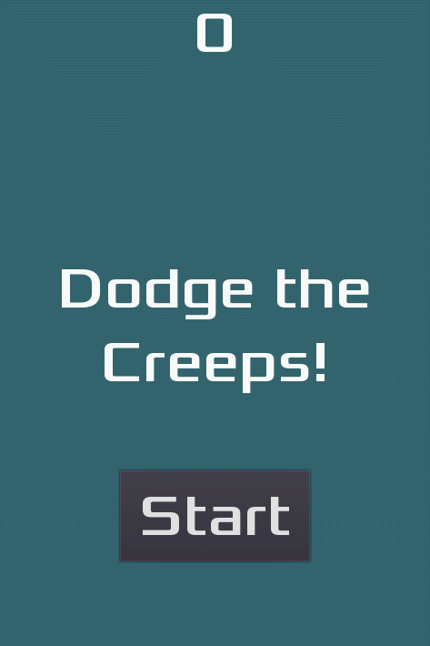

# Dodge The Creeps with C++



Before compilating the project you need to compile the C++ bindings library (godot-cpp).
On this example, "scons" is required to do the compilation.

Scons can be installed using the next command with python:

```bash
python -m pip install scons
```

### Compiling the C++ bindings library

The final step is to compile our C++ bindings library:

```bash
cd godot-cpp
scons platform=<your platform> generate_bindings=yes
cd ..
```

Replace `<your platform>` with either `windows`, `linux`, `osx` or `android`. If
you leave out `platform`, the target platform will automatically be detected
from the host platform.

The resulting library will be created in `godot-cpp/bin/`, take note of its name
as it'll differ depending on the target platform.

Compilation instructions extracted from here: 
https://github.com/godotengine/godot-cpp

### Compiling the project
While you are in the "Godot-Dodge-The-Creeps-with-Cpp" folder use the next lines in console:

```bash
cl /Fosrc\ /c src/*.cpp /nologo -EHsc -DNDEBUG /MDd /Igodot-cpp\include /Igodot-cpp\include\core /Igodot-cpp\include\gen /Igodot-cpp\godot-headers

link /nologo /dll /out:DodgeTheCreeps\bin\libg.dll /implib:DodgeTheCreeps\bin\libgd.lib src\*.obj godot-cpp\bin\libgodot-cpp.windows.debug.64.lib
```
In my case the compiler used was "MSVC" with the "x64 Native Tools Command Prompt for vs 2019"
